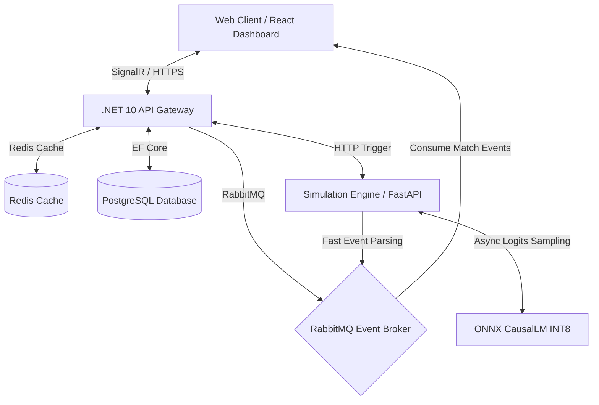

# PixelPitchAI — Football Match Simulation & Management Monorepo

[](https://github.com/Nader7x/Footex/actions/workflows/ci.yml)


Footex is an enterprise-grade football management and live match simulation platform. It operates as a monorepo containing a high-performance C# backend, a real-time responsive frontend dashboard, and a dedicated AI simulation engine.

<video src="https://github.com/user-attachments/assets/4f688e9f-40d2-44fd-942f-53787ecd2d31"></video>

---

## 🏗️ System Architecture



---

## 📦 Component Layout

The monorepo consists of three core services:

### 1. ⚡ [Core API Backend](file:///d:/programming/GitHub/Footex/backend)
An enterprise-grade, clean architecture backend built using **.NET 10 (C#)**.
* **Core Technologies**: ASP.NET Core, EF Core, PostgreSQL, SignalR, Serilog.
* **Key Features**: High-performance user management, team databases, statistics tracking, and JWT security.
* **AOT Compliance**: Fully prepared for Native Ahead-of-Time compilation (zero reflection, static DI, compile-time logging/JSON serializers).

### 2. 🏟️ [Simulation Engine](file:///d:/programming/GitHub/Footex/simulation-engine)
A high-performance AI text generation service built with **FastAPI (Python 3.12)**.
* **Core Models**: Fine-tuned GPT-2 for play-by-play commentary generation, and XGBoost for predictively setting team statistics.
* **CPU Acceleration**: Uses **INT8 dynamically-quantized ONNX Runtime** with physical core thread pinning, producing a **2.67x (53 tokens/s)** CPU inference speedup.
* **GPU Capability**: Seamlessly falls back to native PyTorch CUDA execution (e.g. NVIDIA RTX 3090) in production.
* **Event Broker**: Publishes match events asynchronously to RabbitMQ during live generation.

### 3. 🌐 [Frontend Dashboard](file:///d:/programming/GitHub/Footex/frontend)
A modern SPA built with **Next.js 16 (React 19, TypeScript)**.
* **Core Technologies**: Tailwind CSS v4, DaisyUI, Three.js (React Three Fiber for 3D stadium visualizations).
* **Key Features**: Real-time scoreboard with SignalR live-commentary, dark/light modes, role-based auth, and multi-language support (next-intl).

---

## 🐳 Docker Quick Start

Bring up the entire ecosystem (including Caddy Reverse Proxy, PostgreSQL, Redis, RabbitMQ, and all services) using Docker Compose:

```bash
# 1. Setup environment files
.\docker-manage.ps1 setup

# 2. Start the development stack
.\docker-manage.ps1 dev-up
```

### Host Endpoints (Dev)
* **Web Portal**: `http://localhost:3000`
* **Swagger API Docs**: `http://localhost:5025/swagger`
* **RabbitMQ Dashboard**: `http://localhost:15672` (guest/guest)
* **API Health Check**: `http://localhost:5025/health`

---

## 🔧 Infrastructure & Settings

The services depend on configuration variables provided in `.env` (production) and `.env.dev` (development). Make sure to configure:
* **JWT Settings** (`JWT_KEY`, `JWT_ISSUER`)
* **Database Credentials** (`POSTGRES_DB`, `POSTGRES_USER`, `POSTGRES_PASSWORD`)
* **SMTP Config** (`SMTP_HOST`, `SMTP_PORT`, `SMTP_FROM_EMAIL`)

---

## 🧪 Testing and Verification
The monorepo contains a robust test suite with 92.2% coverage:
```bash
# Test C# Backend projects
dotnet test ./backend/Footex.sln

# Run simulation benchmarks
cd simulation-engine && uv run python scripts/performance_comparison.py
```

Refer to individual service directories for domain-specific guides and APIs.
