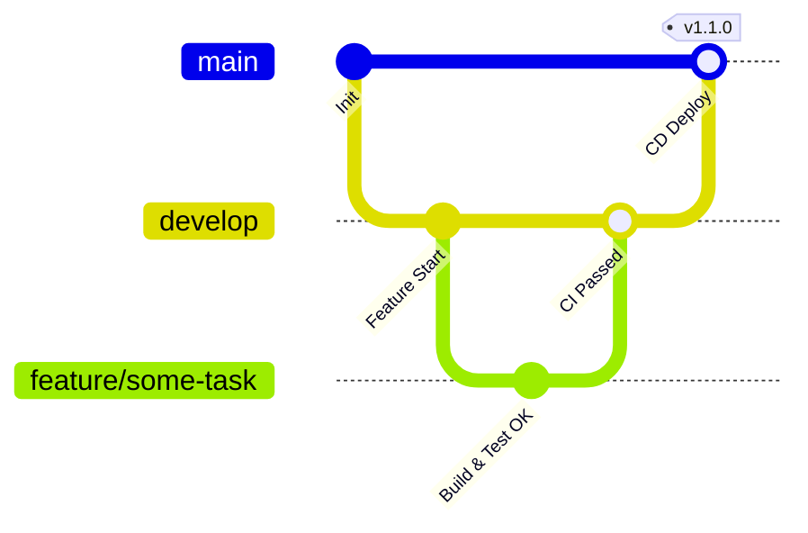

# Professional CI/CD Implementation Strategy for PixelPitchAI

This document outlines a professional Git branching and CI/CD strategy tailored for the PixelPitchAI repository to ensure secure, clean, and fast deployments.

---

## 1. Git Branching Model (GitFlow / Trunk-based Hybrid)



### Branches & Roles:
* **`main`**: The production branch. 
  - Represents the current live state of the application.
  - Only accepts merges from `develop` via pull requests or release tags.
* **`develop`**: The integration branch.
  - Developers merge feature branches here first.
  - Represents the staging environment.
* **`feature/*`**: Short-lived branches.
  - Created from `develop` for individual tasks/fixes.
  - Merged back into `develop` via pull requests.

---

## 2. CI/CD Workflow Triggers & Separation

To keep the pipeline fast and responsive, we separate **Continuous Integration (testing)** from **Continuous Delivery (deployment)**.

```
┌──────────────────────────┐      ┌──────────────────────────┐
│        Push to PR        │      │    Push / Merge to main  │
└────────────┬─────────────┘      └────────────┬─────────────┘
             │                                 │
             ▼                                 ▼
┌──────────────────────────┐      ┌──────────────────────────┐
│       CI Pipeline        │      │   Deploy to Production   │
│ (Test, Scan, Quality OK) │      │  (Build Image, Deploy)   │
└──────────────────────────┘      └──────────────────────────┘
```

### A. CI Pipeline (`ci.yml`)
* **Triggers**: 
  - Every `pull_request` targeting `main` or `develop`.
  - Every `push` to `develop`.
  - **Does not run on pushes to `main`** to avoid redundant test suite runs when merging code that already passed CI checks in the PR.
* **Actions**:
  - Code linting (Hadolint for Docker, Pnpm/ESLint for frontend).
  - Run Unit and Integration tests.
  - CodeQL static code analysis.
  - Security vulnerability scans (Dependency-Check, Gitleaks, Checkov).

### B. Deployment Pipeline (`deploy.yml`)
* **Triggers**:
  - Every `push` directly to `main` (e.g. when merging a pull request).
  - Manual trigger via `workflow_dispatch` (allowing on-demand deployment of any specific commit).
* **Actions**:
  - SSH connection to the production VM.
  - Pull latest codebase changes from `main`.
  - Build/rebuild docker containers (`docker compose up -d --build`).
  - Perform HTTP health check validation (`curl -sf http://<host>:8080/api/health`).

---

## 3. Best Practices & Optimizations

### 1. Dependency Caching
Speed up build execution times by utilizing GitHub Action's built-in caches:
* **.NET**: Use `actions/setup-dotnet` with caching enabled.
* **PNPM/NPM**: Use `actions/setup-node` with `cache: 'pnpm'`.

### 2. Job Conditions & Fail-Safe
To avoid deploying broken builds:
* Make the deployment workflow depend on the success of the CI workflow via **GitHub Environment Protection Rules** or status check requirements.
* Require at least one approved PR review before code can be merged into `main`.

### 3. Skips & Tags
* Use `[skip ci]` in the commit message if you are editing documentation (`README.md`, `/docs`) to avoid wasting GitHub Action runner minutes.
* Keep commit history atomic and follow Conventional Commit standards:
  - Format: `type(scope): description` (e.g. `feat(api): add health check endpoint`).
