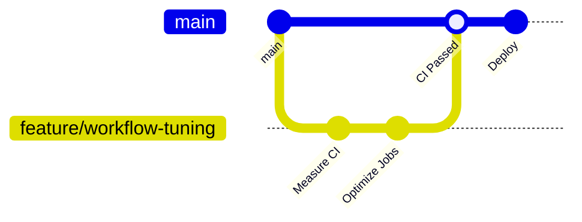

# Professional CI/CD Implementation Strategy for PixelPitchAI

This document defines a simple, professional CI/CD strategy for PixelPitchAI optimized for a solo developer, fast feedback, and low workflow cost while the project is not production-critical yet.

The goal is to keep the pipeline clean, non-conflicting, measurable, and easy to evolve into a production-grade setup later.

---

## Execution Progress

We will traverse this plan from top to bottom. When a point is implemented or verified, mark it as complete.

### Phase 1: Branching and workflow foundations

- [x] Decide whether staging is needed now.
- [x] Adopt solo trunk-based development.
- [x] Confirm `main` is the default branch.
- [x] Confirm no permanent remote `develop` branch is required right now.
- [ ] Configure lightweight branch protection for `main`.
- [x] Align workflow triggers with trunk-based development.
- [x] Add concurrency to all workflows.
- [ ] Add path filters so docs-only or unrelated changes skip expensive jobs.

### Completed ahead of sequence

- [x] Add independent Docker image build workflow: `docker-images.yml`.
- [x] Push Docker images to GHCR with `GITHUB_TOKEN` and `packages: write`.
- [x] Keep current SSH deploy unchanged while image publishing is introduced.

---

## 1. Do We Need Staging?

For the current project state: **no, a dedicated staging branch/environment is not required yet**.

Because this is a solo project and not production yet, maintaining a permanent `develop` branch and staging environment would add process overhead without much benefit. The better approach is:

- [x] Use `main` as the single source of truth.
- [x] Use short-lived `feature/*`, `fix/*`, or `ci/*` branches when a change is non-trivial.
- [x] Use pull requests into `main` when you want CI validation before merge.
- [x] Use `workflow_dispatch` for manual deploys when you want control.
- [x] Add staging later only when you have real users, production data, multiple contributors, or risky deploys.

### Add staging later when any of these become true

- The app has real users depending on uptime.
- Deployments need manual QA before production.
- Database migrations become risky.
- Multiple people contribute at the same time.
- You need a production-like environment for demos, acceptance testing, or client review.

---

## 2. Branching Model: Solo Trunk-Based Development



### Branches & Roles

- [x] **`main`**
  - Primary branch and source of truth.
  - Should stay deployable.
  - Deploy workflow runs from here.
  - Verified as the GitHub default branch.

- [x] **`feature/*`, `fix/*`, `ci/*`, `docs/*`**
  - Short-lived working branches.
  - Use PRs into `main` for meaningful changes.
  - Direct commits to `main` are acceptable for tiny solo changes, but PRs are better when optimizing CI/CD because they show workflow behavior clearly.

- [x] **No permanent `develop` branch for now**
  - Verified remote branches currently only include `origin/main`.
  - Add `develop` later only if a real staging environment becomes useful.

### Recommended branch protection for `main`

Since this is solo and pre-production, start light:

- [ ] Require status checks before merge: **recommended**.
- [ ] Require pull request before merge: optional for now.
- [x] Require approvals: not necessary while working alone.
- [ ] Block force pushes: recommended.
- [ ] Require conversation resolution: optional.

Current GitHub status: `main` is not protected yet.

When production becomes real, tighten this to require PRs and passing CI before every merge.

---

## 3. Workflow Architecture

PixelPitchAI is a monorepo with three major areas:

- `backend/` — .NET API
- `frontend/` — Next.js app
- `simulation-engine/` — Python/FastAPI AI simulation service

Workflows should avoid duplicated work. Each workflow should own one responsibility.

| Workflow | Purpose | Trigger | Speed Target |
|---|---|---|---|
| `ci.yml` | Fast build, lint, and tests | PRs to `main`, pushes to `main`, manual | Fast |
| `docker-images.yml` | Build/push service images to GHCR | Push to `main`, PR validation, manual | Medium |
| `security-monitoring.yml` | Heavy security checks | Schedule, manual, security-sensitive changes | Slower OK |
| `performance.yml` | Load/stress/benchmark tests | Manual, weekly, PR label | Slow OK |
| `deploy.yml` | Deploy current `main` | Push to `main`, manual | Medium |
| `release.yml` | Versioned GitHub releases | Tags `v*.*.*`, manual | Slow OK |

---

## 4. CI Pipeline (`ci.yml`)

### Triggers

Recommended:

```yaml
on:
  pull_request:
    branches: [main]
  push:
    branches: [main]
    paths-ignore:
      - "docs/**"
      - "**/*.md"
      - "README.md"
  workflow_dispatch:
```

For maximum speed, later replace broad CI with path-filtered jobs:

- Backend jobs run only when `backend/**`, `.github/workflows/**`, or Docker/backend config changes.
- Frontend jobs run only when `frontend/**` changes.
- Simulation jobs run only when `simulation-engine/**` changes.
- Docs-only changes skip expensive jobs automatically.

### Actions

CI should stay focused on fast correctness checks:

- Backend restore/build/unit tests.
- Backend integration tests only when backend code changes.
- Frontend install/lint/build when frontend code changes.
- Simulation dependency validation and tests when simulation code changes.
- Dockerfile lint/build smoke checks only when Docker-related files change.

Avoid running heavy CodeQL, Dependency-Check, Trivy, Checkov, full secrets scans, and performance tests on every normal CI run.

---

## 5. Security Monitoring (`security-monitoring.yml`)

Security scans should be separated from fast CI.

### Triggers

Recommended:

```yaml
on:
  schedule:
    - cron: "37 4 * * *"
  workflow_dispatch:
  pull_request:
    branches: [main]
    paths:
      - ".github/workflows/**"
      - "backend/**/*.csproj"
      - "frontend/package.json"
      - "frontend/pnpm-lock.yaml"
      - "simulation-engine/pyproject.toml"
      - "simulation-engine/uv.lock"
      - "**/Dockerfile*"
      - "docker-compose*.yml"
```

### Actions

- CodeQL static analysis.
- Dependency vulnerability scans.
- Gitleaks/TruffleHog secrets scan.
- Trivy container scan.
- Hadolint Dockerfile linting.
- Checkov IaC/GitHub Actions scan.

### Important rule

Do **not** duplicate CodeQL in both `ci.yml` and `security-monitoring.yml`. Keep it in security monitoring unless you specifically want CodeQL as a required branch protection check.

---

## 6. Performance Tests (`performance.yml`)

Performance tests are expensive and should not run by default.

### Triggers

- Weekly schedule.
- Manual `workflow_dispatch`.
- PR label such as `performance`.

### Actions

- Load tests.
- Stress tests.
- Micro-benchmarks.
- Upload performance reports.
- Optional regression comparison against a saved baseline.

Keep this workflow isolated from regular CI so normal development stays fast.

---

## 7. Deployment Pipeline (`deploy.yml`)

Deployment should be simple while the project is pre-production.

### Triggers

```yaml
on:
  push:
    branches: [main]
  workflow_dispatch:
```

### Current simple deployment model

While the project is pre-production, deployment can stay simple:

- SSH into the VM.
- Pull latest `main`.
- Rebuild/recreate containers on the VM.
- Run health checks.

```bash
git pull origin main
docker compose up -d --build
curl -sf http://<host>:8080/api/health
```

This is easy to understand, but it is not the fastest or most reproducible model because every deploy rebuilds on the VM.

### Professional deployment model

The target production-grade model is:

1. CI builds Docker images.
2. CI pushes images to GitHub Container Registry (GHCR).
3. Images are tagged immutably, usually with the commit SHA.
4. The VM pulls those exact image tags.
5. Deploy updates containers without rebuilding on the VM.
6. Health checks verify all public services.
7. Rollback redeploys the previous known-good image tag.

Recommended image tags:

```text
ghcr.io/<owner>/<repo>/footex-api:<git-sha>
ghcr.io/<owner>/<repo>/football-frontend:<git-sha>
ghcr.io/<owner>/<repo>/simulation-engine:<git-sha>
```

Optional convenience tags:

```text
ghcr.io/<owner>/<repo>/footex-api:main
ghcr.io/<owner>/<repo>/football-frontend:main
ghcr.io/<owner>/<repo>/simulation-engine:main
```

Deploy flow:

```bash
docker compose pull
docker compose up -d --remove-orphans
curl -sf http://<host>:8080/api/health
curl -sf http://<host>:8000/health
curl -sf http://<host>/
```

### Migration path from simple to professional deploy

Do this in phases:

1. Keep current SSH deploy working.
2. Add a dedicated image build workflow/job that builds but does not deploy.
3. Push images to GHCR using `GITHUB_TOKEN` and `packages: write`.
4. Update `docker-compose.yml` to support image tags through environment variables.
5. Change deploy to pull images instead of building on the VM.
6. Add rollback notes using the previous image SHA.

### Phase 1 status

Implemented first three migration items:

- Current SSH deployment remains unchanged in `deploy.yml`.
- `docker-images.yml` builds backend, frontend, and simulation Docker images independently from deployment.
- `docker-images.yml` pushes images to GHCR on `main` and manual runs using `GITHUB_TOKEN` with `packages: write`.
- Pull requests build the images for validation but do not push them.

Phase 1 image outputs:

```text
ghcr.io/<owner>/<repo>/footex-api:<tag>
ghcr.io/<owner>/<repo>/football-frontend:<tag>
ghcr.io/<owner>/<repo>/simulation-engine:<tag>
```

Current tags:

- branch tag, for example `main`
- pull request tag, for example `pr-123`
- commit tag, for example `sha-<short-sha>`

### GitHub Environment

Even before production, define a `production` environment when deploys matter:

```yaml
environment:
  name: production
```

For now, required reviewers are optional because you work alone. Later, add manual approval before production deployment.

---

## 8. Release Automation (`release.yml`)

Releases should be separate from normal deployment.

### Triggers

- Git tags: `v*.*.*`
- Manual `workflow_dispatch`

### Actions

- Validate version.
- Generate changelog.
- Build release artifacts if needed.
- Build and push versioned Docker images if needed.
- Create GitHub Release.

Do not run release automation on every push to `main`.

---

## 9. Core Optimization Rules

### 1. Add concurrency to all workflows

For CI/security/performance/release:

```yaml
concurrency:
  group: ${{ github.workflow }}-${{ github.ref }}
  cancel-in-progress: true
```

For production deploys:

```yaml
concurrency:
  group: production
  cancel-in-progress: false
```

This prevents wasting minutes on outdated runs and prevents conflicting deployments.

### 2. Use path filters

Prefer `paths` and `paths-ignore` over relying on `[skip ci]`.

Good examples:

```yaml
paths-ignore:
  - "docs/**"
  - "**/*.md"
```

```yaml
paths:
  - "backend/**"
  - ".github/workflows/ci.yml"
```

### 3. Cache dependencies

#### .NET

Use `actions/setup-dotnet@v4`. If lock files exist, enable built-in cache. Otherwise use `actions/cache` for NuGet packages.

#### PNPM

Pin pnpm instead of using latest:

```yaml
- uses: pnpm/action-setup@v4
  with:
    version: 11

- uses: actions/setup-node@v4
  with:
    node-version: 22
    cache: pnpm
    cache-dependency-path: frontend/pnpm-lock.yaml
```

#### Python / uv

```yaml
- uses: astral-sh/setup-uv@v5
  with:
    enable-cache: true
```

### 4. Minimize permissions

Use the minimum permissions per workflow.

Examples:

```yaml
permissions:
  contents: read
```

```yaml
permissions:
  contents: read
  security-events: write
```

```yaml
permissions:
  contents: read
  packages: write
```

Prefer `GITHUB_TOKEN` over a personal access token when possible.

### 5. Avoid duplicated restore/build work

Current CI patterns often restore and build the same solution in multiple jobs. Optimize by either:

- merging related jobs,
- using artifacts between jobs,
- or accepting duplication only when parallelism is faster than artifact overhead.

Measure before changing.

---

## 10. Measurable Workflow Optimization Process

Every workflow change should be measurable. Use GitHub CLI before and after each optimization so improvements are based on evidence instead of guesses.

### Step 1: List recent workflow runs

```bash
gh run list --limit 20
```

Use this to identify:

- which workflows run most often,
- which workflows fail repeatedly,
- which events trigger expensive runs,
- whether docs or small changes are triggering unnecessary work.

### Step 2: Inspect one workflow run

```bash
gh run view <run-id>
```

Use this for a quick summary of jobs, status, and failed steps.

### Step 3: Inspect job timing data

```bash
gh run view <run-id> --json jobs
```

Human-readable timing summary:

```bash
gh run view <run-id> --json jobs \
  --jq '.jobs[] | {name, conclusion, startedAt, completedAt}'
```

More detailed job and step timing:

```bash
gh run view <run-id> --json jobs \
  --jq '.jobs[] | {job: .name, conclusion, startedAt, completedAt, steps: [.steps[] | {name, conclusion, startedAt, completedAt}]}'
```

### Step 4: Inspect logs for slow or failing steps

```bash
gh run view <run-id> --log
```

Use logs to answer:

- Did dependency restore use cache?
- Did Docker BuildKit use cache?
- Did a service wait/health check consume most of the time?
- Did a tool download large dependencies every run?
- Did failures happen before or after expensive work?

### Step 5: Record before/after notes

For each workflow optimization, record:

```text
Workflow: <name>
Run before: <run-id>, duration <time>, conclusion <status>
Bottleneck: <slow job/step>
Change: <what changed>
Run after: <run-id>, duration <time>, conclusion <status>
Result: <faster/slower/no change>
Next action: <follow-up>
```

This can live in PR notes, commit messages when useful, or a short docs section if the optimization is important.

### Optimization questions for each workflow

- Which jobs are slowest?
- Which steps are slowest?
- Which jobs duplicate restore/build?
- Which jobs should run in parallel?
- Which jobs should be path-filtered?
- Which jobs can use cache?
- Which jobs should move to schedule/manual only?
- Which workflow triggers are too broad?
- Which artifacts are uploaded unnecessarily?
- Which permissions are broader than needed?
- Which jobs should be split for clarity?
- Which jobs should be merged to avoid repeated setup?

### Suggested review order

Review workflows from highest impact to lowest:

1. `ci.yml` — most important because it runs during normal development.
2. `deploy.yml` — important because conflicting deploys can break environments.
3. `security-monitoring.yml` — usually expensive; move heavy scans out of fast CI.
4. `performance.yml` — expensive; keep manual/scheduled/label-only.
5. `release.yml` — less frequent, optimize after correctness is clear.

---

## 11. Target End State

For the current solo pre-production phase, the ideal setup is:

```text
ci.yml
  Fast checks on PR/main
  Path-filtered backend/frontend/simulation jobs
  No heavy security/performance scans by default

docker-images.yml
  Build backend/frontend/simulation images
  Push to GHCR on main/manual
  Build only on PRs
  Use commit SHA and branch tags

security-monitoring.yml
  Daily/manual/security-sensitive changes
  CodeQL, dependency scans, secrets, Trivy, Checkov, Hadolint

performance.yml
  Weekly/manual/PR label only
  Load, stress, benchmark, report

deploy.yml
  Push to main/manual
  One deploy at a time
  VM deploy + health checks

release.yml
  Tags/manual only
  Versioned artifacts and GitHub Releases
```

This gives a professional pipeline without over-engineering staging before the project needs it.
