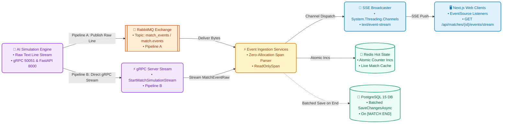

# Event Processing System Documentation

## Overview

The PixelPitchAI Event Processing System is a high-performance, low-latency event ingestion, processing, and streaming architecture. It implements **Dual Streaming Ingestion**:
- **Pipeline A (Decoupled Queue Ingestion)**: RabbitMQ topic exchange `match_events`, routing key `match.events`, queue `match_events_queue`.
- **Pipeline B (Direct Low-Latency Ingestion)**: Direct memory-to-memory gRPC server-streaming via `StartMatchSimulationStream` on port 50051.

Both pipelines converge on `ZeroAllocationEventParser` with `ReadOnlySpan<char>` slicing before broadcasting live simulation events to clients exclusively via **Server-Sent Events (SSE)** at `GET /api/matches/{id}/events/stream`.

## System Architecture

### Component Overview



### Key Components

1. **AI Simulation Engine**: Python 3.12 service exposing gRPC `SimulationService` on port 50051.
   Concurrently, it hosts a FastAPI REST API on port 8000 via `asyncio` inside Uvicorn lifespan.
2. **Pipeline A (RabbitMQ Ingestion)**: Topic exchange `match_events`, routing key `match.events`, queue `match_events_queue`.
3. **Pipeline B (Direct gRPC Server-Streaming)**: Unidirectional streaming RPC `StartMatchSimulationStream` yielding raw commentary text lines directly into backend memory.
4. **Zero-Allocation Parser (`ZeroAllocationEventParser`)**: High-performance parser utilizing `ReadOnlySpan<char>` and stack-allocated spans without heap substrings.
5. **Server-Sent Events Broadcaster (`MatchEventBroadcaster`)**: Multi-subscriber fanout built on `System.Threading.Channels.Channel<SseMessage>` serving `GET /api/matches/{id}/events/stream`.
6. **Redis Hot State**: Atomic in-memory counters for real-time scores, possession, and pass statistics.
7. **PostgreSQL Batched Persistence**: EF Core 10 background persistence that commits all accumulated events in a single atomic transaction upon `[MATCH END]`.

## Event Flow Architecture

### 1. Dual Ingestion Pipelines

```
Pipeline A: Simulation Engine → RabbitMQ (match_events) → MatchEventRabbitMqClient
Pipeline B: Simulation Engine → gRPC Stream (port 50051) → MatchEventGrpcStreamConsumer
```

### 2. Zero-Allocation Processing Pipeline

```
Raw Text Stream → ZeroAllocationEventParser (ReadOnlySpan<char>) → Hot State & Broadcaster
```

**Pipeline Steps**:

1. **Zero-Allocation Parsing**: Slices tokens and coordinates directly in-place from `ReadOnlySpan<char>`.
2. **Validation**: Validates event action types, team ownership, and field coordinates.
3. **Hot State Updates**: Updates Redis and in-memory live statistics (`LiveMatchStatisticsService`).
4. **SSE Broadcasting**: Dispatches `match_event` and `match_statistics` payloads to active client channels.
5. **In-Memory Accumulation**: Buffers events in memory for post-match persistence.
6. **Batched Persistence**: Executes single `SaveChangesAsync()` to PostgreSQL when `[MATCH END]` is reached.

### 3. Client Match Event Distribution

```
MatchStreamController → GET /api/matches/{id}/events/stream (SSE) → Browser EventSource
```

**Distribution Strategy**:

- **Match-specific Groups**: Users following specific matches
- **Team-based Groups**: Fans of particular teams
- **Global Notifications**: System-wide announcements
- **User-specific Messages**: Personal notifications

## Event Types & Processing

### Core Event Types

#### Football Match Events

The system processes real football match events using the `FootballMatchEvent` domain model:

```csharp
public class FootballMatchEvent
{
    public string action { get; set; }      // "shot", "pass", "foul committed", etc.
    public string type { get; set; }        // "Free Kick", "Goal Kick", "Corner", etc.
    public string outcome { get; set; }     // "Goal", "Complete", "Saved", etc.
    public string team { get; set; }        // Team name
    public string player { get; set; }      // Player name
    public int time_seconds { get; set; }   // Event timestamp in seconds
    public string? card { get; set; }       // "Yellow Card", "Red Card", "No Card"
    public bool? long_pass { get; set; }    // Indicates long pass
    // Additional properties...
}
```

#### Event Action Types

The event processors handle these main action types:

**Shot Events** (`action == "shot"`):

- Goal scoring attempts
- Shots on target and off target
- Saves by goalkeepers
- Blocked shots
- Free kick shots

**Pass Events** (`action == "pass"`):

- All passing attempts
- Pass completion tracking
- Long ball statistics
- Throw-ins and goal kicks
- Pass accuracy calculations

**Foul Events**:

- `action == "foul committed"` - Fouls committed by players
- `action == "foul won"` - Fouls drawn by players
- `action == "bad behaviour"` - Disciplinary actions

#### Processing Rules by Event Type

**Shot Event Processing**:

```csharp
// Update shot counters
if (IsHomeTeam(matchEvent, match))
    match.HomeTeamShots = IncrementValue(match.HomeTeamShots);
else
    match.AwayTeamShots = IncrementValue(match.AwayTeamShots);

// Process outcomes
switch (matchEvent.outcome)
{
    case "Goal":
        // Update score and shots on target
        break;
    case "Saved":
        // Update shots on target and saves
        break;
    case "Wayward":
    case "Off T":
        // Update shots off target
        break;
}
```

**Pass Event Processing**:

```csharp
// Update pass counters
if (IsHomeTeam(matchEvent, match))
    match.HomeTeamPasses = IncrementValue(match.HomeTeamPasses);
else
    match.AwayTeamPasses = IncrementValue(match.AwayTeamPasses);

// Process pass completion
if (matchEvent.outcome == "Complete")
{
    // Update completed passes
    // Update long ball accuracy if applicable
}
```

**Foul Event Processing**:

```csharp
// Update foul counters
if (matchEvent.action == "foul committed")
{
    if (IsHomeTeam(matchEvent, match))
        match.HomeTeamFouls = IncrementValue(match.HomeTeamFouls);
    else
        match.AwayTeamFouls = IncrementValue(match.AwayTeamFouls);

    // Process cards
    ProcessCard(matchEvent, match);
}
```

### Event Processing Pipeline

#### 1. Message Validation

```csharp
public class EventValidationService
{
    public async Task<ValidationResult> ValidateEvent(FootballMatchEvent matchEvent)
    {
        var validationRules = new List<IValidationRule>
        {
            new MatchExistsRule(),
            new PlayerEligibilityRule(),
            new TimelineConsistencyRule(),
            new EventTypeValidationRule()
        };

        foreach (var rule in validationRules)
        {
            var result = await rule.ValidateAsync(matchEvent);
            if (!result.IsValid)
            {
                return result;
            }
        }

        return ValidationResult.Success();
    }
}
```

#### 2. EventAnalysisService Integration

```csharp
public class MatchEventProcessingService
{
    private readonly IEventAnalysisService _eventAnalysisService;
    private readonly IMatchEventBroadcaster _broadcaster;

    public async Task ProcessMatchEvent(FootballMatchEvent matchEvent, Match match, MatchEvents matchEvents)
    {
        try
        {
            // 1. Update match statistics using EventAnalysisService
            var updatedMatchEvents = await _eventAnalysisService
                .UpdateMatchStatistics(matchEvent, matchEvents, match, withCounters: true);

            // 2. Update possession calculations
            PossessionCalculator.UpdatePossession(match, matchEvent);

            // 3. Persist changes to database
            await _unitOfWork.SaveChangesAsync();

            // 4. Broadcast real-time updates via Server-Sent Events (SSE)
            await _broadcaster.BroadcastEventAsync(match.Id.ToString(), matchEvent);

            // 5. Update cache
            await InvalidateMatchCache(match.Id);

        }
        catch (Exception ex)
        {
            _logger.LogError(ex, "Failed to process match event {EventType} for match {MatchId}",
                matchEvent.action, match.Id);
            throw;
        }
    }
}
```

#### 3. Possession Calculation Integration

```csharp
public static class PossessionCalculator
{
    /// <summary>
    /// Updates possession statistics for a match based on the current event
    /// </summary>
    public static void UpdatePossession(Match match, FootballMatchEvent currentEvent)
    {
        UpdatePossessionDuration(match, currentEvent);
        DeterminePossessingTeam(match, currentEvent);
        CalculatePossessionPercentages(match);
    }

    private static void UpdatePossessionDuration(Match match, FootballMatchEvent currentEvent)
    {
        if (match.LastEventTimestampSeconds.HasValue && match.LastEventPossessingTeamName != null)
        {
            var durationSeconds = currentEvent.time_seconds - match.LastEventTimestampSeconds.Value;
            if (durationSeconds > 0)
            {
                if (match.LastEventPossessingTeamName == match.HomeTeamInMatchName)
                {
                    match.HomeTeamPossessionDurationSeconds =
                        (match.HomeTeamPossessionDurationSeconds ?? 0) + durationSeconds;
                }
                else if (match.LastEventPossessingTeamName == match.AwayTeamInMatchName)
                {
                    match.AwayTeamPossessionDurationSeconds =
                        (match.AwayTeamPossessionDurationSeconds ?? 0) + durationSeconds;
                }
            }
        }
    }
}
```

#### 4. Base Event Processor Architecture

````csharp
public abstract class BaseEventProcessor : IEventProcessor
{
    public abstract bool CanProcess(FootballMatchEvent matchEvent);
    public abstract void ProcessMatchEvent(FootballMatchEvent matchEvent, Match match);
    public abstract void ProcessEventCounters(FootballMatchEvent matchEvent, MatchEvents matchEvents, Match match);

    /// <summary>
    /// Helper method to safely increment a nullable int value
    /// </summary>
    protected static int IncrementValue(int? currentValue) => (currentValue ?? 0) + 1;

    /// <summary>
    /// Determines if the event is from the home team
    /// </summary>
    protected static bool IsHomeTeam(FootballMatchEvent matchEvent, Match match) =>
        matchEvent.team == match.HomeTeamInMatchName;

    /// <summary>
    /// Gets the opposing team name
    /// </summary>
    protected static string? GetOpponentTeam(string currentTeamName, Match match)
    {
        if (currentTeamName == match.HomeTeamInMatchName)
            return match.AwayTeamInMatchName;
        if (currentTeamName == match.AwayTeamInMatchName)
            return match.HomeTeamInMatchName;
        return null;
    }
}

#### 2. Event Processing Architecture
```csharp
public class EventAnalysisService : IEventAnalysisService
{
    private readonly IEnumerable<IEventProcessor> _eventProcessors;

    public EventAnalysisService(IEnumerable<IEventProcessor> eventProcessors)
    {
        _eventProcessors = eventProcessors;
    }

    public async Task<MatchEvents> UpdateMatchStatistics(
        FootballMatchEvent matchEvent,
        MatchEvents matchEventsEntity,
        Match match,
        bool withCounters = true)
    {
        // First, update the match statistics
        await UpdateMatchStatistics(matchEvent, match);

        // Then, if requested, update the event counters
        if (withCounters)
        {
            // Find the appropriate processor and process the event
            var processor = _eventProcessors.FirstOrDefault(p => p.CanProcess(matchEvent));
            processor?.ProcessEventCounters(matchEvent, matchEventsEntity, match);

            // Increment the total events counter
            matchEventsEntity.TotalEvents++;
        }

        return matchEventsEntity;
    }
}
````

#### 3. Event Processor Interface

```csharp
public interface IEventProcessor
{
    /// <summary>
    /// Determines if this processor can handle the specified match event
    /// </summary>
    bool CanProcess(FootballMatchEvent matchEvent);

    /// <summary>
    /// Process the match event and update match statistics
    /// </summary>
    void ProcessMatchEvent(FootballMatchEvent matchEvent, Match match);

    /// <summary>
    /// Process the match event and update match events counters
    /// </summary>
    void ProcessEventCounters(FootballMatchEvent matchEvent, MatchEvents matchEvents, Match match);
}
```

#### 4. Concrete Event Processors

**Shot Event Processor**:

```csharp
public class ShotEventProcessor : BaseEventProcessor
{
    public override bool CanProcess(FootballMatchEvent matchEvent) =>
        matchEvent.action == "shot";

    public override void ProcessMatchEvent(FootballMatchEvent matchEvent, Match match)
    {
        // Handle free kick shots
        if (matchEvent.type == "Free Kick")
        {
            if (IsHomeTeam(matchEvent, match))
                match.HomeTeamFreeKicks = IncrementValue(match.HomeTeamFreeKicks);
            else
                match.AwayTeamFreeKicks = IncrementValue(match.AwayTeamFreeKicks);
        }

        // Update shots counter
        if (IsHomeTeam(matchEvent, match))
            match.HomeTeamShots = IncrementValue(match.HomeTeamShots);
        else
            match.AwayTeamShots = IncrementValue(match.AwayTeamShots);

        // Process shot outcomes (Goal, Saved, Wayward, etc.)
        ProcessShotOutcome(matchEvent, match);
    }
}
```

**Pass Event Processor**:

```csharp
public class PassEventProcessor : BaseEventProcessor
{
    public override bool CanProcess(FootballMatchEvent matchEvent) =>
        matchEvent.action == "pass";

    public override void ProcessMatchEvent(FootballMatchEvent matchEvent, Match match)
    {
        // Increment pass count
        if (IsHomeTeam(matchEvent, match))
            match.HomeTeamPasses = IncrementValue(match.HomeTeamPasses);
        else
            match.AwayTeamPasses = IncrementValue(match.AwayTeamPasses);

        // Process pass outcomes (Complete, Incomplete, Offside, etc.)
        ProcessPassOutcome(matchEvent, match);

        // Handle special pass types (Goal Kick, Throw-in, etc.)
        ProcessPassType(matchEvent, match);
    }
}
```

**Foul Event Processor**:

```csharp
public class FoulEventProcessor : BaseEventProcessor
{
    public override bool CanProcess(FootballMatchEvent matchEvent) =>
        matchEvent.action == "foul committed" ||
        matchEvent.action == "foul won" ||
        matchEvent.action == "bad behaviour";

    public override void ProcessMatchEvent(FootballMatchEvent matchEvent, Match match)
    {
        if (matchEvent.action == "foul committed")
        {
            if (IsHomeTeam(matchEvent, match))
                match.HomeTeamFouls = IncrementValue(match.HomeTeamFouls);
            else
                match.AwayTeamFouls = IncrementValue(match.AwayTeamFouls);

            ProcessCard(matchEvent, match);
        }
        else if (matchEvent.action == "bad behaviour")
        {
            ProcessCard(matchEvent, match);
        }
    }
}
```

## Event Processing Service Architecture

### EventAnalysisService Integration

The `EventAnalysisService` serves as the central orchestrator for match event processing, utilizing a collection of specialized event processors to handle different types of football events.

#### Service Registration

```csharp
// In DependencyInjection.cs
services.AddScoped<IEventAnalysisService, EventAnalysisService>();

// Register all event processors
services.AddScoped<IEventProcessor, ShotEventProcessor>();
services.AddScoped<IEventProcessor, PassEventProcessor>();
services.AddScoped<IEventProcessor, FoulEventProcessor>();
```

#### Processing Flow

```csharp
public async Task ProcessMatchEvent(FootballMatchEvent matchEvent, Match match, MatchEvents matchEvents)
{
    // 1. Use EventAnalysisService to update statistics
    var updatedMatchEvents = await _eventAnalysisService
        .UpdateMatchStatistics(matchEvent, matchEvents, match, withCounters: true);

    // 2. The service internally:
    //    - Finds appropriate processor using CanProcess()
    //    - Calls ProcessMatchEvent() to update match statistics
    //    - Calls ProcessEventCounters() to update event counters
    //    - Updates possession via PossessionCalculator
    //    - Calculates pass accuracy

    // 3. Persist changes
    await _unitOfWork.SaveChangesAsync();

    // 4. Broadcast updates via Server-Sent Events (SSE)
    await _broadcaster.BroadcastEventAsync(match.Id.ToString(), matchEvent);
}
```

### Event Processor Implementations

#### 1. ShotEventProcessor

Handles all shooting events including goals, saves, and missed shots.

**Capabilities**:

- Shot counting (on/off target)
- Goal scoring and match result updates
- Goalkeeper save statistics
- Free kick shots
- Shot blocking statistics

**Event Counters Updated**:

```csharp
public override void ProcessEventCounters(FootballMatchEvent matchEvent, MatchEvents matchEvents, Match match)
{
    matchEvents.TotalShots++;

    if (matchEvent.type == "Free Kick")
        matchEvents.TotalFreeKicks++;

    switch (matchEvent.outcome)
    {
        case "Blocked":
            matchEvents.TotalBlocks++;
            break;
        case "Goal":
            matchEvents.TotalGoals++;
            break;
        case "Saved":
            matchEvents.TotalGoalkeeperSaves++;
            break;
    }
}
```

#### 2. PassEventProcessor

Handles all passing events including completions, long balls, and special situations.

**Capabilities**:

- Pass completion tracking
- Long ball accuracy
- Goal kicks and throw-ins
- Interceptions and recoveries
- Offside violations

**Event Counters Updated**:

```csharp
public override void ProcessEventCounters(FootballMatchEvent matchEvent, MatchEvents matchEvents, Match match)
{
    matchEvents.TotalPasses++;

    switch (matchEvent.type)
    {
        case "Free Kick":
            matchEvents.TotalFreeKicks++;
            break;
        case "Goal Kick":
            matchEvents.TotalGoalKicks++;
            break;
        case "Interception":
            matchEvents.TotalInterceptions++;
            break;
        case "Recovery":
            matchEvents.TotalPossessionWon++;
            break;
        case "Throw-in":
            matchEvents.TotalThrowIns++;
            break;
    }
}
```

#### 3. FoulEventProcessor

Handles disciplinary events including fouls and card issuances.

**Capabilities**:

- Foul counting for both teams
- Yellow and red card tracking
- Penalty situation detection
- Free kick awards
- Disciplinary record maintenance

**Card Processing**:

```csharp
private static void ProcessCard(FootballMatchEvent matchEvent, Match match)
{
    if (matchEvent.card == null || matchEvent.card == "No Card")
        return;

    switch (matchEvent.card)
    {
        case "Yellow Card":
            if (IsHomeTeam(matchEvent, match))
                match.HomeTeamYellowCards = IncrementValue(match.HomeTeamYellowCards);
            else
                match.AwayTeamYellowCards = IncrementValue(match.AwayTeamYellowCards);
            break;

        case "Red Card":
            if (IsHomeTeam(matchEvent, match))
                match.HomeTeamRedCards = IncrementValue(match.HomeTeamRedCards);
            else
                match.AwayTeamRedCards = IncrementValue(match.AwayTeamRedCards);
            break;
    }
}
```

### Advanced Processing Features

#### Possession Calculation

The `PossessionCalculator` works alongside event processors to maintain real-time possession statistics:

```csharp
public static void UpdatePossession(Match match, FootballMatchEvent currentEvent)
{
    // 1. Update possession duration based on time between events
    UpdatePossessionDuration(match, currentEvent);

    // 2. Determine which team currently has possession
    DeterminePossessingTeam(match, currentEvent);

    // 3. Calculate possession percentages
    CalculatePossessionPercentages(match);
}
```

#### Pass Accuracy Calculation

Automatic calculation of pass accuracy percentages:

```csharp
private static void CalculatePassAccuracy(Match match)
{
    // Home team pass accuracy
    if (match.HomeTeamPasses.HasValue && match.HomeTeamPassesCompleted.HasValue && match.HomeTeamPasses > 0)
    {
        match.HomeTeamPassAccuracy = Math.Round(
            (double)match.HomeTeamPassesCompleted.Value * 100 / match.HomeTeamPasses.Value, 2);
    }

    // Away team pass accuracy
    if (match.AwayTeamPasses.HasValue && match.AwayTeamPassesCompleted.HasValue && match.AwayTeamPasses > 0)
    {
        match.AwayTeamPassAccuracy = Math.Round(
            (double)match.AwayTeamPassesCompleted.Value * 100 / match.AwayTeamPasses.Value, 2);
    }
}
```

### Real-Time Distribution Architecture: Server-Sent Events (SSE)

Match simulation events are distributed to client browsers exclusively via **Server-Sent Events (SSE)** at `GET /api/matches/{id}/events/stream`. This replaces legacy WebSocket and SignalR protocols for live match commentary.

> [!NOTE]
> SignalR is retained strictly for the `NotificationService` (`/Notify`) delivering general user alerts and notifications. Do not use SignalR for match simulation streaming, which is replaced by SSE.

#### Broadcaster & Channel Fanout

- **Broadcaster**: `MatchEventBroadcaster` (`IMatchEventBroadcaster`)
- **Concurrency Model**: Bounded `System.Threading.Channels.Channel<SseMessage>` per subscriber (`BoundedChannelFullMode.DropOldest`, capacity 500)
- **Endpoint**: `GET /api/matches/{id}/events/stream`
- **Wire Headers**:
  - `Content-Type: text/event-stream`
  - `Cache-Control: no-cache`
  - `Connection: keep-alive`
  - `X-Accel-Buffering: no`
- **Authentication**: JWT token passed via query parameter (`?access_token=`)

### Client Communication Patterns: Native EventSource

```javascript
class MatchEventStreamingClient {
  constructor() {
    this.eventSource = null;
  }

  connectToMatch(matchId, token, onEvent, onStatistics, onError) {
    const url = `/api/matches/${matchId}/events/stream?access_token=${encodeURIComponent(token)}`;
    this.eventSource = new EventSource(url);

    // Play-by-play simulation events (passes, shots, goals, tackles)
    this.eventSource.addEventListener("match_event", (event) => {
      const payload = JSON.parse(event.data);
      onEvent(payload);
    });

    // Real-time statistical summaries
    this.eventSource.addEventListener("match_statistics", (event) => {
      const stats = JSON.parse(event.data);
      onStatistics(stats);
    });

    this.eventSource.onerror = (err) => {
      console.error("SSE stream error", err);
      onError?.(err);
    };
  }

  disconnect() {
    if (this.eventSource) {
      this.eventSource.close();
      this.eventSource = null;
    }
  }
}
```

#### Event Handling Strategies

```javascript
class MatchEventHandler {
  handleGoalEvent(matchId, goalData) {
    // 1. Update UI immediately
    this.updateScore(goalData);

    // 2. Trigger animations/effects
    this.showGoalCelebration(goalData);

    // 3. Update local state
    this.updateMatchState(matchId, goalData);

    // 4. Notify other components
    this.eventBus.emit("goal-scored", goalData);
  }

  handleConnectionLoss(matchId) {
    // 1. Switch to polling mode
    this.startPollingFallback(matchId);

    // 2. Show connection status
    this.showConnectionWarning();

    // 3. Attempt reconnection
    this.attemptReconnection(matchId);
  }
}
```

## Database Integration

### Event Sourcing Pattern

#### Event Store Schema

```sql
CREATE TABLE MatchEvents (
    Id UNIQUEIDENTIFIER PRIMARY KEY,
    MatchId UNIQUEIDENTIFIER NOT NULL,
    EventType NVARCHAR(50) NOT NULL,
    Timestamp DATETIME2 NOT NULL,
    Minute INT,
    PlayerId UNIQUEIDENTIFIER,
    TeamId UNIQUEIDENTIFIER,
    EventData NVARCHAR(MAX), -- JSON data
    ProcessedAt DATETIME2 NOT NULL,
    Version INT NOT NULL,
    INDEX IX_MatchEvents_MatchId_Timestamp (MatchId, Timestamp),
    INDEX IX_MatchEvents_EventType (EventType),
    INDEX IX_MatchEvents_ProcessedAt (ProcessedAt)
);
```

#### Event Replay Capability

```csharp
public class EventReplayService
{
    public async Task<List<MatchEventMessage>> ReplayMatchEvents(
        Guid matchId,
        DateTime? fromTimestamp = null)
    {
        var query = _dbContext.MatchEvents
            .Where(e => e.MatchId == matchId)
            .OrderBy(e => e.Timestamp);

        if (fromTimestamp.HasValue)
        {
            query = query.Where(e => e.Timestamp >= fromTimestamp.Value);
        }

        var events = await query.ToListAsync();

        return events.Select(e => new MatchEventMessage
        {
            EventId = e.Id.ToString(),
            MatchId = e.MatchId.ToString(),
            EventType = e.EventType,
            Timestamp = e.Timestamp,
            EventData = JsonSerializer.Deserialize<Dictionary<string, object>>(e.EventData)
        }).ToList();
    }
}
```

### CQRS Implementation

#### Command Side (Write Operations)

```csharp
public class MatchEventCommandHandler
{
    public async Task HandleAsync(ProcessMatchEventCommand command)
    {
        // 1. Validate command
        await ValidateCommand(command);

        // 2. Create domain event
        var domainEvent = CreateDomainEvent(command);

        // 3. Persist event
        await _eventStore.AppendAsync(domainEvent);

        // 4. Update read models
        await _readModelUpdater.UpdateAsync(domainEvent);

        // 5. Publish integration event
        await _eventBus.PublishAsync(domainEvent);
    }
}
```

#### Query Side (Read Operations)

```csharp
public class MatchEventQueryHandler
{
    public async Task<MatchEventQueryResult> HandleAsync(GetMatchEventsQuery query)
    {
        // Use read models for optimized queries
        var cachedResult = await _cache.GetAsync(query.CacheKey);
        if (cachedResult != null)
        {
            return cachedResult;
        }

        var result = await _readModelRepository.GetMatchEventsAsync(query);
        await _cache.SetAsync(query.CacheKey, result, TimeSpan.FromMinutes(5));

        return result;
    }
}
```

## Performance Optimization

### Caching Strategy

#### Multi-level Caching

```csharp
public class EventCachingService
{
    private readonly IMemoryCache _l1Cache;
    private readonly IDistributedCache _l2Cache;
    private readonly IDatabase _database;

    public async Task<T> GetAsync<T>(string key)
    {
        // L1 Cache (Memory)
        if (_l1Cache.TryGetValue(key, out T value))
        {
            return value;
        }

        // L2 Cache (Redis)
        var cachedData = await _l2Cache.GetStringAsync(key);
        if (cachedData != null)
        {
            value = JsonSerializer.Deserialize<T>(cachedData);
            _l1Cache.Set(key, value, TimeSpan.FromMinutes(2));
            return value;
        }

        // Database fallback
        value = await _database.GetAsync<T>(key);
        if (value != null)
        {
            await _l2Cache.SetStringAsync(key, JsonSerializer.Serialize(value));
            _l1Cache.Set(key, value, TimeSpan.FromMinutes(2));
        }

        return value;
    }
}
```

#### Cache Invalidation Strategies

```csharp
public class CacheInvalidationService
{
    public async Task InvalidateMatchCache(Guid matchId)
    {
        var patterns = new[]
        {
            $"match_{matchId}*",
            $"match_events_{matchId}*",
            $"match_statistics_{matchId}*",
            $"team_*_{matchId}*"
        };

        foreach (var pattern in patterns)
        {
            await InvalidateByPattern(pattern);
        }
    }

    public async Task InvalidateByPattern(string pattern)
    {
        var keys = await GetKeysByPattern(pattern);
        await _cache.RemoveAsync(keys.ToArray());
    }
}
```

### Message Processing Optimization

#### Batch Processing

```csharp
public class BatchEventProcessor
{
    private readonly List<MatchEventMessage> _batch = new();
    private readonly Timer _batchTimer;
    private const int BatchSize = 100;
    private const int BatchTimeoutMs = 5000;

    public async Task ProcessMessage(MatchEventMessage message)
    {
        lock (_batch)
        {
            _batch.Add(message);

            if (_batch.Count >= BatchSize)
            {
                _ = Task.Run(ProcessBatch);
            }
        }
    }

    private async Task ProcessBatch()
    {
        List<MatchEventMessage> currentBatch;

        lock (_batch)
        {
            currentBatch = new List<MatchEventMessage>(_batch);
            _batch.Clear();
        }

        if (currentBatch.Any())
        {
            await ProcessMessages(currentBatch);
        }
    }
}
```

#### Parallel Processing

```csharp
public class ParallelEventProcessor
{
    private readonly SemaphoreSlim _semaphore;
    private readonly int _maxConcurrency;

    public async Task ProcessEvents(IEnumerable<MatchEventMessage> events)
    {
        var tasks = events.Select(async @event =>
        {
            await _semaphore.WaitAsync();
            try
            {
                await ProcessEvent(@event);
            }
            finally
            {
                _semaphore.Release();
            }
        });

        await Task.WhenAll(tasks);
    }
}
```

## Monitoring & Observability

### Metrics Collection

#### Key Performance Indicators

```csharp
public class EventProcessingMetrics
{
    public static readonly Counter MessagesProcessed = Metrics
        .CreateCounter("pixelpitchai_events_processed_total", "Total number of events processed");

    public static readonly Histogram ProcessingDuration = Metrics
        .CreateHistogram("pixelpitchai_event_processing_duration_seconds",
            "Time taken to process events");

    public static readonly Gauge ActiveConnections = Metrics
        .CreateGauge("pixelpitchai_sse_connections_active",
            "Number of active SSE match stream connections");

    public static readonly Counter ProcessingErrors = Metrics
        .CreateCounter("pixelpitchai_event_processing_errors_total",
            "Total number of processing errors");
}
```

#### Health Checks

```csharp
public class EventProcessingHealthCheck : IHealthCheck
{
    public async Task<HealthCheckResult> CheckHealthAsync(
        HealthCheckContext context,
        CancellationToken cancellationToken = default)
    {
        try
        {
            // Check RabbitMQ connection
            var rabbitMqHealthy = await CheckRabbitMqHealth();

            // Check SSE broadcaster health
            var sseHealthy = await CheckSseBroadcasterHealth();

            // Check database connectivity
            var databaseHealthy = await CheckDatabaseHealth();

            if (rabbitMqHealthy && sseHealthy && databaseHealthy)
            {
                return HealthCheckResult.Healthy("Event processing system is healthy");
            }

            return HealthCheckResult.Degraded("Some components are unhealthy");
        }
        catch (Exception ex)
        {
            return HealthCheckResult.Unhealthy("Event processing system is down", ex);
        }
    }
}
```

### Logging Strategy

#### Structured Logging

```csharp
public class EventProcessingLogger
{
    private readonly ILogger<EventProcessingLogger> _logger;

    public void LogEventProcessed(MatchEventMessage @event, TimeSpan processingTime)
    {
        _logger.LogInformation("Event processed {@Event} in {ProcessingTime}ms",
            new
            {
                EventId = @event.EventId,
                MatchId = @event.MatchId,
                EventType = @event.EventType,
                Timestamp = @event.Timestamp
            },
            processingTime.TotalMilliseconds);
    }

    public void LogProcessingError(MatchEventMessage @event, Exception exception)
    {
        _logger.LogError(exception,
            "Failed to process event {EventId} for match {MatchId}",
            @event.EventId, @event.MatchId);
    }
}
```

#### Correlation Tracking

```csharp
public class CorrelationMiddleware
{
    public async Task InvokeAsync(HttpContext context, RequestDelegate next)
    {
        var correlationId = context.Request.Headers["X-Correlation-ID"].FirstOrDefault()
            ?? Guid.NewGuid().ToString();

        context.Items["CorrelationId"] = correlationId;

        using (_logger.BeginScope(new Dictionary<string, object>
        {
            ["CorrelationId"] = correlationId
        }))
        {
            await next(context);
        }
    }
}
```

## Error Handling & Resilience

### Circuit Breaker Pattern

```csharp
public class EventProcessingCircuitBreaker
{
    private readonly CircuitBreakerPolicy _circuitBreaker;

    public EventProcessingCircuitBreaker()
    {
        _circuitBreaker = Policy
            .Handle<Exception>()
            .CircuitBreakerAsync(
                handledEventsAllowedBeforeBreaking: 5,
                durationOfBreak: TimeSpan.FromSeconds(30),
                onBreak: (exception, duration) =>
                {
                    _logger.LogWarning("Circuit breaker opened for {Duration}", duration);
                },
                onReset: () =>
                {
                    _logger.LogInformation("Circuit breaker reset");
                });
    }

    public async Task ExecuteAsync(Func<Task> operation)
    {
        await _circuitBreaker.ExecuteAsync(operation);
    }
}
```

### Retry Policies

```csharp
public class EventProcessingRetryPolicy
{
    private readonly RetryPolicy _retryPolicy;

    public EventProcessingRetryPolicy()
    {
        _retryPolicy = Policy
            .Handle<HttpRequestException>()
            .Or<TimeoutException>()
            .WaitAndRetryAsync(
                retryCount: 3,
                sleepDurationProvider: retryAttempt =>
                    TimeSpan.FromSeconds(Math.Pow(2, retryAttempt)),
                onRetry: (outcome, timespan, retryCount, context) =>
                {
                    _logger.LogWarning("Retry attempt {RetryCount} after {Delay}ms",
                        retryCount, timespan.TotalMilliseconds);
                });
    }
}
```

## Security Considerations

### Authentication & Authorization

```csharp
public class EventSecurityService
{
    public async Task<bool> CanUserAccessMatch(string userId, Guid matchId)
    {
        // Check if match is public
        var match = await _matchService.GetMatchAsync(matchId);
        if (match.IsPublic)
        {
            return true;
        }

        // Check user subscriptions
        var hasSubscription = await _subscriptionService
            .HasActiveSubscriptionAsync(userId);

        return hasSubscription;
    }

    public async Task<bool> CanUserReceiveNotification(string userId, string notificationType)
    {
        var preferences = await _userPreferencesService
            .GetNotificationPreferencesAsync(userId);

        return preferences.IsEnabled(notificationType);
    }
}
```

### Input Validation

```csharp
public class EventValidationService
{
    public ValidationResult ValidateEvent(MatchEventMessage @event)
    {
        var validator = new MatchEventValidator();
        return validator.Validate(@event);
    }
}

public class MatchEventValidator : AbstractValidator<MatchEventMessage>
{
    public MatchEventValidator()
    {
        RuleFor(x => x.EventId)
            .NotEmpty()
            .Must(BeValidGuid);

        RuleFor(x => x.MatchId)
            .NotEmpty()
            .Must(BeValidGuid);

        RuleFor(x => x.EventType)
            .NotEmpty()
            .Must(BeValidEventType);

        RuleFor(x => x.Minute)
            .GreaterThanOrEqualTo(0)
            .LessThanOrEqualTo(120);
    }
}
```

## Deployment & Operations

### Docker Configuration

```dockerfile
FROM mcr.microsoft.com/dotnet/aspnet:6.0 AS runtime
WORKDIR /app

COPY --from=build /app/publish .

# Health check endpoint
HEALTHCHECK --interval=30s --timeout=10s --start-period=5s --retries=3 \
    CMD curl -f http://localhost:80/health || exit 1

ENTRYPOINT ["dotnet", "Footex.EventProcessing.dll"]
```

### Kubernetes Deployment

```yaml
apiVersion: apps/v1
kind: Deployment
metadata:
  name: footex-event-processing
spec:
  replicas: 3
  selector:
    matchLabels:
      app: footex-event-processing
  template:
    metadata:
      labels:
        app: footex-event-processing
    spec:
      containers:
        - name: event-processing
          image: footex/event-processing:latest
          ports:
            - containerPort: 80
          env:
            - name: RabbitMQ__ConnectionString
              valueFrom:
                secretKeyRef:
                  name: rabbitmq-secret
                  key: connection-string
          livenessProbe:
            httpGet:
              path: /health
              port: 80
            initialDelaySeconds: 30
            periodSeconds: 10
          readinessProbe:
            httpGet:
              path: /health/ready
              port: 80
            initialDelaySeconds: 5
            periodSeconds: 5
```

## Best Practices

### Development Guidelines

1. **Event Design**: Keep events immutable and focused on single business facts
2. **Error Handling**: Implement comprehensive error handling with proper logging
3. **Testing**: Write unit and integration tests for all components
4. **Documentation**: Maintain up-to-date documentation for all processes

### Production Considerations

1. **Monitoring**: Implement comprehensive monitoring and alerting
2. **Scaling**: Design for horizontal scaling from the beginning
3. **Security**: Implement proper authentication, authorization, and input validation
4. **Performance**: Regular performance testing and optimization

### Operational Excellence

1. **Observability**: Implement distributed tracing and comprehensive logging
2. **Automation**: Automate deployment, scaling, and recovery processes
3. **Disaster Recovery**: Implement proper backup and recovery procedures
4. **Capacity Planning**: Monitor resource usage and plan for growth
