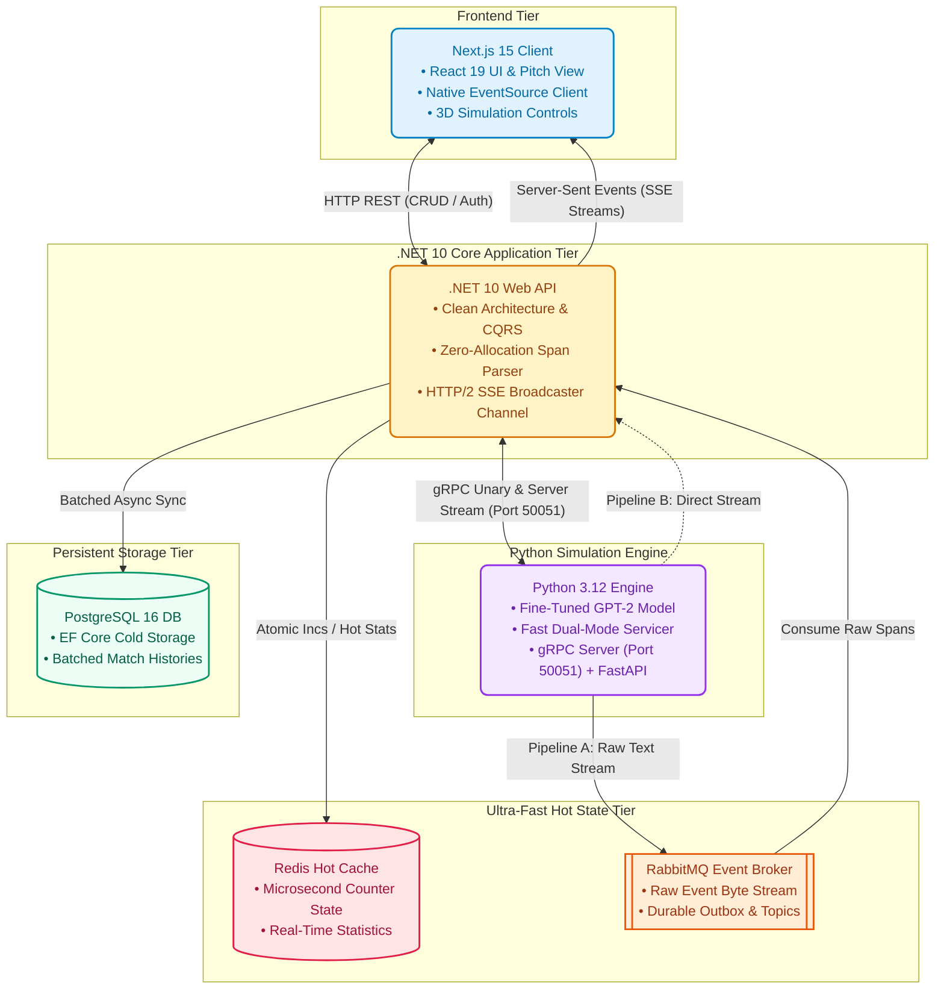
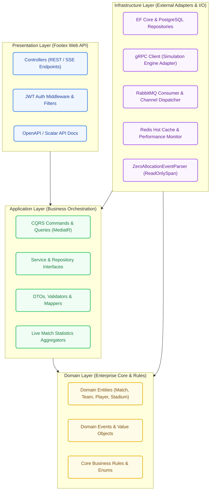
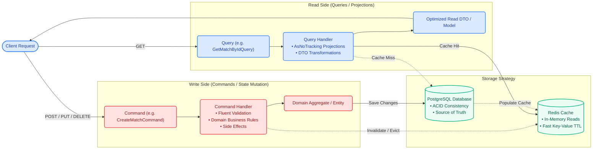
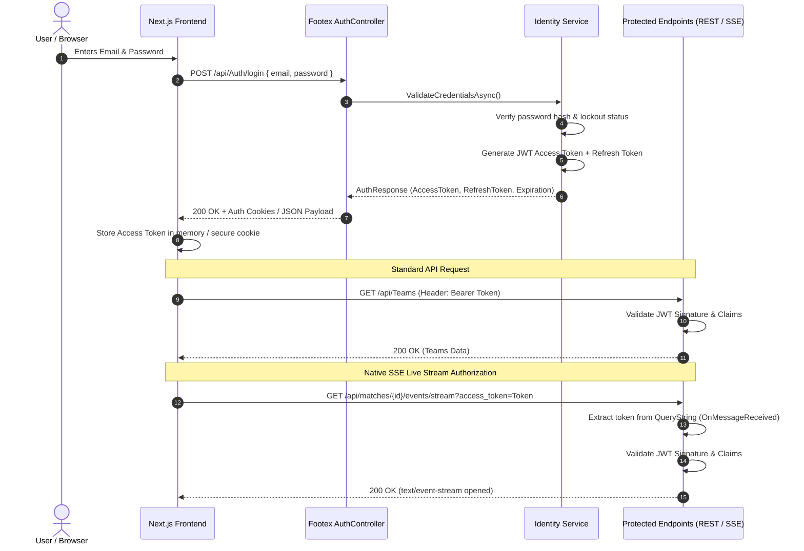

# Footex Project Architecture Documentation

## 📋 Table of Contents

- [Overview](#overview)
- [Overall System Architecture](#overall-system-architecture)
- [Architecture Principles](#architecture-principles)
- [Project Structure](#project-structure)
- [Layer Definitions](#layer-definitions)
- [Design Patterns](#design-patterns)
- [Technology Stack](#technology-stack)
- [Infrastructure Components](#infrastructure-components)
- [Development & Deployment](#development--deployment)
- [Benefits](#benefits)
- [Best Practices](#best-practices)

## 🎯 Overview

Footex is a comprehensive football management platform built using Clean Architecture principles with .NET 10. The project implements a layered architecture that promotes separation of concerns, testability, and maintainability while providing a robust foundation for scalable football management operations.

The system manages football teams, players, matches, stadiums, seasons, and provides real-time match simulation capabilities with advanced analytics and caching mechanisms.

## 🌐 Overall System Architecture

Footex is designed as a distributed microservices architecture where the .NET API serves as the central orchestration layer, bridging the Next.js frontend with a Python FastAPI-powered AI model for intelligent match simulation and analytics.

### System Components



### Additional Architecture Diagrams

#### **Clean Architecture Layers Diagram**



#### **CQRS Pattern Flow Diagram**



#### **Real-Time Match Simulation Sequence Diagram**

```mermaid
sequenceDiagram
    autonumber
    actor Client as Next.js Frontend
    participant API as .NET 10 Web API
    participant gRPC as Python gRPC (50051)
    participant Engine as GPT-2 Simulation Engine
    participant RabbitMQ as RabbitMQ Broker
    participant Redis as Redis Hot State
    participant DB as PostgreSQL Database

    Client->>API: POST /api/Matches/SimulateMatch/{userId}
    API->>gRPC: StartMatchSimulation(match_id, teams, params)
    gRPC-->>API: StartMatchResponse (simulation_id, status: started)
    API-->>Client: 200 OK (MatchCreated & SimulationStarted)

    Note over Client,API: Client subscribes to SSE stream
    Client->>API: GET /api/matches/{id}/events/stream?access_token=...
    API-->>Client: HTTP/2 200 OK (text/event-stream)

    par Dual Streaming Pipeline
        Note over gRPC,Engine: Pipeline B: Direct Server-Streaming (Optional)
        Engine-->>API: gRPC MatchEventRaw stream chunks
    and Pipeline A: Raw Broker Stream
        Engine->>RabbitMQ: publish_raw_event(raw_text_line)
        RabbitMQ->>API: Deliver raw text bytes
    end

    loop High-Throughput Event Processing
        Note over API: ZeroAllocationEventParser.TryParseEvent(span)
        API->>Redis: Update Hot Counters (Goals, Shots, Passes)
        API->>Client: SSE event: match_event (JSON payload)
        API->>Client: SSE event: match_statistics (Hot Stats)
    end

    Note over API,DB: Batch Match End Persistence
    API->>DB: Bulk insert match events & fina#### **Data Flow Architecture Diagram**

```mermaid
flowchart TD
    classDef frontend fill:#e0f2fe,stroke:#0284c7,stroke-width:2px,color:#0369a1,rx:6px,ry:6px;
    classDef gateway fill:#fef3c7,stroke:#d97706,stroke-width:2px,color:#92400e,rx:6px,ry:6px;
    classDef broker fill:#ffedd5,stroke:#ea580c,stroke-width:2px,color:#9a3412,rx:6px,ry:6px;
    classDef ai fill:#f3e8ff,stroke:#9333ea,stroke-width:2px,color:#6b21a8,rx:6px,ry:6px;
    classDef cache fill:#ffe4e6,stroke:#e11d48,stroke-width:2px,color:#9f1239,rx:6px,ry:6px;
    classDef db fill:#ecfdf5,stroke:#059669,stroke-width:2px,color:#065f46,rx:6px,ry:6px;

    UI["Next.js Web Application"]:::frontend

    subgraph Gateway [".NET 10 Application Gateway"]
        Controllers["REST & SSE Controllers"]:::gateway
        CQRS["CQRS Dispatcher"]:::gateway
        Parser["Zero-Allocation Span Parser"]:::gateway
    end

    subgraph Messaging ["Async Transport Layer"]
        MQ["RabbitMQ Topic Exchange<br/>(match.events)"]:::broker
    end

    subgraph Intelligence ["Python AI Simulation Core"]
        FastAPI["FastAPI REST"]:::ai
        gRPCServer["gRPC Server (50051)"]:::ai
        GPT2["Fine-Tuned GPT-2 Engine"]:::ai
    end

    subgraph FastStorage ["In-Memory Data Tier"]
        Redis[("Redis 7<br/>• Live Match Counters<br/>• Query Cache<br/>• Session Storage")]:::cache
    end

    subgraph RelationalDB ["Relational Data Tier"]
        EF["EF Core 10 ORM"]:::db
        PG[("PostgreSQL 16 Database<br/>• Matches & Teams<br/>• Player Profiles & Stats")]:::db
    end

    UI <-->|"HTTP/REST (CRUD Operations)"| Controllers
    Controllers -->|"Real-time SSE Push (text/event-stream)"| UI
    Controllers --> CQRS
    CQRS <-->|"gRPC RPCs"| gRPCServer
    gRPCServer --> GPT2
    GPT2 -->|"Publish Raw Line"| MQ
    MQ -->|"Stream Raw Events"| Parser
    Parser -->|"Atomic Stats Updates"| Redis
    CQRS <-->|"Cache-Aside Pattern"| Redis
    CQRS --> EF
    EF --> PG
```

#### **Security & Authentication Flow**



### Architecture Flow

#### 1. **User Interaction Flow**

```
User Action (Frontend) → HTTP API Call → .NET API Controller
→ CQRS Command/Query → Business Logic → Database/Cache
→ Response → Frontend Update
```

#### 2. **Real-Time Match Simulation Flow**

```
Match Start Request (Frontend)
→ .NET API Endpoint
→ Message to RabbitMQ
→ Python AI Model Processing
→ Match Events Generated
→ Events to RabbitMQ
→ .NET API Event Handler
→ SignalR Hub Broadcast
→ Real-time Frontend Updates
```

#### 3. **Event Processing Pipeline**

```
AI Model Events → RabbitMQ Queue → .NET Background Service
→ Database Update → Cache Invalidation → SignalR Notification
→ Frontend Real-time Update
```

### Component Responsibilities

#### **Next.js Frontend**

- **Primary Role**: User interface and experience
- **Responsibilities**:
  - Responsive web application with modern UI/UX
  - Real-time match visualization and updates
  - User authentication and session management
  - State management for application data
  - WebSocket connection handling for live updates

#### **.NET API (Current Project) - Central Orchestrator**

- **Primary Role**: Business logic orchestration and API gateway
- **Responsibilities**:
  - RESTful API endpoints for all business operations
  - CQRS command and query handling
  - Authentication and authorization (JWT)
  - Real-time communication hub (SignalR)
  - Message queue integration and event handling
  - Database operations and data persistence
  - Caching strategy implementation
  - Business rule enforcement
  - Cross-cutting concerns (logging, validation, error handling)

#### **Python FastAPI AI Model**

- **Primary Role**: Intelligent match simulation and analytics
- **Responsibilities**:
  - GPT-2 fine-tuned model for match simulation
  - Real-time match event generation
  - Player performance predictions
  - Team formation optimization
  - Match outcome analytics
  - Statistical analysis and insights
  - Machine learning model training and inference

#### **Message Queue (RabbitMQ)**

- **Primary Role**: Asynchronous communication and event routing
- **Responsibilities**:
  - Decoupling services for scalability
  - Event-driven architecture support
  - Message persistence and reliability
  - Load balancing across consumers
  - Dead letter queue handling
  - Event ordering and delivery guarantees

#### **Database (PostgreSQL)**

- **Primary Role**: Data persistence and integrity
- **Responsibilities**:
  - Transactional data storage
  - ACID compliance
  - Complex queries and relationships
  - Data integrity constraints
  - Backup and recovery
  - Performance optimization

#### **Cache (Redis)**

- **Primary Role**: Performance optimization and session management
- **Responsibilities**:
  - Frequently accessed data caching
  - Session state storage
  - Temporary data storage
  - Rate limiting data
  - Real-time leaderboards

### Communication Patterns

#### **Synchronous Communication**

- **Frontend ↔ .NET API**: HTTP/HTTPS REST calls
- **Frontend ↔ .NET API**: WebSocket (SignalR) for real-time updates
- **.NET API ↔ Database**: Entity Framework Core queries
- **.NET API ↔ Cache**: Redis operations

#### **Asynchronous Communication**

- **.NET API ↔ Python AI**: Message queue communication
- **Event Broadcasting**: RabbitMQ publish/subscribe pattern
- **Background Processing**: Hosted services for event handling

### Data Flow Architecture

#### **Read Operations (CQRS Query Side)**

```
Frontend Request → API Controller → Query Handler → Repository
→ Cache Check → Database (if cache miss) → Response Mapping
→ JSON Response → Frontend
```

#### **Write Operations (CQRS Command Side)**

```
Frontend Request → API Controller → Command Handler → Business Validation
→ Database Transaction → Cache Update → Event Publishing
→ SignalR Notification → Response → Frontend
```

#### **Match Simulation Data Flow**

```
Match Start Command → RabbitMQ Message → Python AI Model
→ Event Stream → RabbitMQ Events → .NET Event Handlers
→ Database Updates → Cache Updates → SignalR Broadcast
→ Real-time Frontend Updates
```

### Scalability & Reliability Features

#### **Horizontal Scaling**

- Stateless .NET API instances
- Load balancer ready
- Database connection pooling
- Cache distribution capabilities

#### **Fault Tolerance**

- Circuit breaker pattern for external services
- Retry policies with exponential backoff
- Dead letter queues for failed message processing
- Health checks and monitoring

#### **Performance Optimization**

- Redis caching for frequently accessed data
- Database query optimization
- Async/await patterns throughout
- Connection pooling and resource management

### Security Architecture

#### **Authentication & Authorization**

- JWT token-based authentication
- Role-based access control (RBAC)
- Secure HTTP-only cookies
- CORS policy configuration

#### **Data Protection**

- HTTPS enforcement
- SQL injection prevention via EF Core
- Input validation and sanitization
- Secure coding practices

### Deployment Architecture

#### **Containerization**

- Docker containers for each service
- Docker Compose for local development
- Production-ready Dockerfile configurations
- Environment-specific configurations

#### **Infrastructure as Code**

- Docker Compose orchestration
- Environment variable management
- Service discovery and networking
- Volume management for data persistence

This distributed architecture provides several key advantages:

1. **Separation of Concerns**: Each service has a specific responsibility
2. **Technology Flexibility**: Each service can use the most appropriate technology
3. **Independent Scaling**: Services can be scaled independently based on demand
4. **Fault Isolation**: Issues in one service don't cascade to others
5. **Development Velocity**: Teams can work on different services simultaneously
6. **Maintainability**: Clear boundaries make the system easier to understand and modify

## 🏛️ Architecture Principles

### Clean Architecture

The project follows Uncle Bob's Clean Architecture pattern, ensuring:

- **Independence of Frameworks**: Business logic doesn't depend on external frameworks
- **Testability**: Business rules can be tested without UI, database, web server, or external elements
- **Independence of UI**: UI can change without changing the business rules
- **Independence of Database**: Business rules are not bound to the database
- **Independence of External Services**: Business rules don't know about the outside world

### SOLID Principles

- **Single Responsibility**: Each class has one reason to change
  - **Example**: The `IEmailService` interface in `Application/Interfaces` handles only email-related functionality, while `IFileStorageService` is strictly responsible for file operations. This separation ensures changes to email logic don't affect file operations.
  
  ```csharp
  // Single Responsibility Example
  public interface IEmailService
  {
      Task SendEmailAsync(string to, string subject, string body);
      Task SendConfirmationEmailAsync(string to, string token);
      Task SendPasswordResetEmailAsync(string to, string token);
  }
  
  public interface IFileStorageService
  {
      Task<string> SaveFileAsync(Stream fileStream, string fileName);
      Task<bool> DeleteFileAsync(string filePath);
      Task<Stream> GetFileAsync(string filePath);
  }
  ```

- **Open/Closed**: Open for extension, closed for modification
  - **Example**: The Command/Query handlers in the CQRS pattern (found in `Application/CQRS/`) can be extended with new handlers without modifying existing ones. New match types, notification types, or player operations can be added by creating new handlers rather than modifying existing code.
  
  ```csharp
  // Open/Closed Example with CQRS Handlers
  
  // Existing handler
  public class GetPlayerByIdQueryHandler : IRequestHandler<GetPlayerByIdQuery, PlayerDto>
  {
      private readonly IPlayerRepository _playerRepository;
      
      public GetPlayerByIdQueryHandler(IPlayerRepository playerRepository)
      {
          _playerRepository = playerRepository;
      }
      
      public async Task<PlayerDto> Handle(GetPlayerByIdQuery request, CancellationToken cancellationToken)
      {
          var player = await _playerRepository.GetByIdAsync(request.Id);
          return player.ToDto();
      }
  }
  
  // Adding new functionality by extension, not modification
  public class GetPlayerWithStatsQueryHandler : IRequestHandler<GetPlayerWithStatsQuery, PlayerStatsDto>
  {
      private readonly IPlayerRepository _playerRepository;
      private readonly IPlayerStatsRepository _statsRepository;
      
      public GetPlayerWithStatsQueryHandler(
          IPlayerRepository playerRepository,
          IPlayerStatsRepository statsRepository)
      {
          _playerRepository = playerRepository;
          _statsRepository = statsRepository;
      }
      
      public async Task<PlayerStatsDto> Handle(GetPlayerWithStatsQuery request, CancellationToken cancellationToken)
      {
          var player = await _playerRepository.GetByIdAsync(request.Id);
          var stats = await _statsRepository.GetPlayerStatsAsync(request.Id, request.SeasonId);
          return new PlayerStatsDto(player, stats);
      }
  }
  ```

- **Liskov Substitution**: Objects should be replaceable with instances of their subtypes
  - **Example**: Repository implementations in `Infrastructure/Repositories` all adhere to the interfaces defined in `Domain/Repositories`, allowing the system to substitute any repository implementation (like switching from SQL to in-memory repositories for testing) without altering business logic.
  
  ```csharp
  // Liskov Substitution Example
  
  // Interface in Domain Layer
  public interface ITeamRepository
  {
      Task<Team> GetByIdAsync(int id);
      Task<IEnumerable<Team>> GetAllAsync();
      Task AddAsync(Team team);
      Task UpdateAsync(Team team);
      Task DeleteAsync(int id);
  }
  
  // SQL Implementation in Infrastructure Layer
  public class SqlTeamRepository : ITeamRepository
  {
      private readonly FootballDbContext _context;
      
      public SqlTeamRepository(FootballDbContext context)
      {
          _context = context;
      }
      
      public async Task<Team> GetByIdAsync(int id)
      {
          return await _context.Teams
              .Include(t => t.Stadium)
              .Include(t => t.Players)
              .FirstOrDefaultAsync(t => t.Id == id);
      }
      
      // Other implemented methods...
  }
  
  // InMemory Implementation for Testing
  public class InMemoryTeamRepository : ITeamRepository
  {
      private readonly List<Team> _teams = new();
      
      public async Task<Team> GetByIdAsync(int id)
      {
          return await Task.FromResult(_teams.FirstOrDefault(t => t.Id == id));
      }
      
      // Other implemented methods...
  }
  ```

- **Interface Segregation**: Many client-specific interfaces are better than one general-purpose interface
  - **Example**: The application uses fine-grained interfaces like `IAdvancedSearchService`, `ICacheService`, `IEmailService`, and `IMatchHub` rather than having a single large service interface. This allows clients to depend only on the specific functionality they need.
  
  ```csharp
  // Interface Segregation Example
  
  // Instead of one large interface:
  // public interface IFootexService {
  //     Task SendEmailAsync(string to, string subject, string body);
  //     Task<string> SaveFileAsync(Stream fileStream, string fileName);
  //     Task<SearchResultDto> SearchAsync(string query, int page);
  //     Task UpdateMatchScoreAsync(int matchId, int homeScore, int awayScore);
  // }
  
  // We use segregated interfaces:
  public interface IEmailService
  {
      Task SendEmailAsync(string to, string subject, string body);
  }
  
  public interface IFileStorageService
  {
      Task<string> SaveFileAsync(Stream fileStream, string fileName);
  }
  
  public interface IAdvancedSearchService
  {
      Task<SearchResultDto> SearchAsync(string query, int page);
  }
  
  public interface IMatchHub
  {
      Task UpdateMatchScoreAsync(int matchId, int homeScore, int awayScore);
  }
  
  // This way, a component that only needs search functionality doesn't
  // depend on email or file storage implementations
  public class SearchController : ControllerBase
  {
      private readonly IAdvancedSearchService _searchService;
      
      // Only depends on what it needs
      public SearchController(IAdvancedSearchService searchService)
      {
          _searchService = searchService;
      }
      
      [HttpGet("search")]
      public async Task<ActionResult<SearchResultDto>> Search([FromQuery] string query, int page = 1)
      {
          return await _searchService.SearchAsync(query, page);
      }
  }
  ```

- **Dependency Inversion**: Depend on abstractions, not concretions
  - **Example**: The CQRS handlers in `Application/CQRS/` depend on repository interfaces from `Domain/Interfaces` rather than concrete implementations. This is enforced by the dependency injection setup in `Application/DependencyInjection.cs` and `Infrastructure/DependencyInjection.cs` where concrete implementations are bound to abstractions.
  
  ```csharp
  // Dependency Inversion Example
  
  // Application Layer - depends on abstraction, not concrete implementation
  public class CreateTeamCommandHandler : IRequestHandler<CreateTeamCommand, int>
  {
      private readonly ITeamRepository _teamRepository;
      private readonly IUnitOfWork _unitOfWork;
      
      public CreateTeamCommandHandler(ITeamRepository teamRepository, IUnitOfWork unitOfWork)
      {
          _teamRepository = teamRepository;
          _unitOfWork = unitOfWork;
      }
      
      public async Task<int> Handle(CreateTeamCommand request, CancellationToken cancellationToken)
      {
          var team = new Team
          {
              Name = request.Name,
              Country = request.Country,
              StadiumId = request.StadiumId
          };
          
          await _teamRepository.AddAsync(team);
          await _unitOfWork.SaveChangesAsync(cancellationToken);
          
          return team.Id;
      }
  }
  
  // Infrastructure Layer - Dependency Registration in DependencyInjection.cs
  public static class DependencyInjection
  {
      public static IServiceCollection AddInfrastructure(this IServiceCollection services, IConfiguration configuration)
      {
          // Register database context
          services.AddDbContext<FootballDbContext>(options =>
              options.UseNpgsql(configuration.GetConnectionString("DefaultConnection")));
          
          // Register repositories
          services.AddScoped<ITeamRepository, SqlTeamRepository>();
          services.AddScoped<IPlayerRepository, SqlPlayerRepository>();
          services.AddScoped<IMatchRepository, SqlMatchRepository>();
          services.AddScoped<IUnitOfWork, UnitOfWork>();
          
          return services;
      }
  }
  ```

## 📁 Project Structure

```
Footex/
├── Domain/                 # Core business entities and rules
│   ├── Models/            # Domain entities
│   ├── Interfaces/        # Core interfaces and contracts
│   └── Repositories/      # Repository interfaces
├── Application/           # Business logic and use cases
│   ├── CQRS/             # Command Query Responsibility Segregation
│   │   ├── Auth/         # Authentication commands/queries
│   │   ├── Coaches/      # Coach management
│   │   ├── Matches/      # Match operations
│   │   ├── Players/      # Player management
│   │   ├── Seasons/      # Season management
│   │   ├── Stadiums/     # Stadium operations
│   │   └── Teams/        # Team management
│   ├── Dtos/             # Data Transfer Objects
│   ├── Interfaces/       # Application interfaces
│   ├── Mappers/          # Object mapping logic
│   └── Services/         # Application services
├── Infrastructure/       # External concerns and implementations
│   ├── Repositories/     # Data access implementations
│   ├── Services/         # External service implementations
│   ├── Configurations/   # Entity configurations
│   ├── Migrations/       # Database migrations
│   └── Identity/         # Authentication/authorization
└── Footex/              # Web API layer
    ├── Controllers/      # REST API endpoints
    ├── Configuration/    # API configuration
    ├── Extensions/       # Extension methods
    └── Helpers/          # Utility helpers
```

## 🔄 Layer Definitions

### 1. Domain Layer (Core)

**Purpose**: Contains the business entities, value objects, and domain services.

**Components**:

- **Models**: Core business entities (Team, Player, Match, Stadium, Season, Coach)
- **Interfaces**: Core abstractions (IRepository, IUnitOfWork, IIdentityService)
- **Repositories**: Repository contracts without implementation details

**Key Features**:

- No dependencies on external layers
- Contains business rules and validation logic
- Defines the core behavior of the system

```csharp
// Example: Domain Entity
public sealed class Team
{
    public int Id { get; set; }
    public string? Name { get; set; }
    public string? Country { get; set; }
    public int? StadiumId { get; set; }

    // Navigation properties
    public Stadium? Stadium { get; set; }
    public ICollection<Player>? Players { get; set; }
    public ICollection<Match>? HomeMatches { get; set; }
    public ICollection<Match>? AwayMatches { get; set; }
}
```

### 2. Application Layer

**Purpose**: Orchestrates the domain layer and contains application-specific business logic.

**Components**:

- **CQRS Pattern**: Separate Command and Query operations
- **MediatR Integration**: Implements the mediator pattern for loose coupling
- **DTOs**: Data transfer objects for communication between layers
- **Mappers**: Object-to-object mapping logic
- **Interfaces**: Application service contracts

**Key Features**:

- Implements use cases and business workflows
- Handles cross-cutting concerns like validation
- Coordinates domain objects to fulfill use cases

```csharp
// Example: CQRS Command Handler
public class CreateTeamCommandHandler : IRequestHandler<CreateTeamCommand, CreateTeamCommandResponse>
{
    private readonly IUnitOfWork _unitOfWork;
    private readonly TeamMapper _teamMapper;

    public async Task<CreateTeamCommandResponse> Handle(CreateTeamCommand request, CancellationToken cancellationToken)
    {
        // Business logic implementation
        var team = _teamMapper.MapToEntity(request);
        await _unitOfWork.Teams.AddAsync(team);
        await _unitOfWork.SaveChangesAsync(cancellationToken);

        return new CreateTeamCommandResponse { Succeeded = true, Id = team.Id };
    }
}
```

### 3. Infrastructure Layer

**Purpose**: Handles external concerns and provides implementations for interfaces defined in inner layers.

**Components**:

- **Data Access**: Entity Framework Core implementations
- **External Services**: Third-party integrations
- **Caching**: Redis implementation
- **Message Queuing**: RabbitMQ implementation
- **Identity**: Authentication and authorization services

**Key Features**:

- Implements repository patterns
- Handles database operations and migrations
- Manages external service integrations

```csharp
// Example: Repository Implementation
public class TeamRepository : Repository<Team>, ITeamRepository
{
    private readonly FootballDbContext _context;

    public async Task<Team?> GetByNameAsync(string name)
    {
        return await _context.Teams
            .Include(t => t.Stadium)
            .Include(t => t.Players)
            .FirstOrDefaultAsync(t => t.Name == name);
    }
}
```

### 4. Presentation Layer (Web API)

**Purpose**: Handles HTTP requests and responses, routing, and API documentation.

**Components**:

- **Controllers**: REST API endpoints
- **Middleware**: Cross-cutting concerns (authentication, logging, error handling)
- **Configuration**: Startup and service configuration
- **Swagger/OpenAPI**: API documentation

**Key Features**:

- RESTful API design
- JWT authentication
- Input validation and error handling
- API versioning support

```csharp
// Example: API Controller
[ApiController]
[Route("api/[controller]")]
public class TeamsController : ControllerBase
{
    private readonly IMediator _mediator;

    [HttpPost]
    [Authorize(Roles = "Admin")]
    public async Task<ActionResult<CreateTeamCommandResponse>> CreateTeam([FromBody] CreateTeamCommand command)
    {
        var result = await _mediator.Send(command);
        return result.Succeeded ? Ok(result) : BadRequest(result);
    }
}
```

## 🎨 Design Patterns

### 1. CQRS (Command Query Responsibility Segregation)

**Implementation**: Separate models for read and write operations
**Benefits**:

- Optimized queries for different use cases
- Clear separation between commands and queries
- Improved performance and scalability

### 2. Repository Pattern

**Implementation**: Abstraction layer between domain and data access
**Benefits**:

- Testability through dependency injection
- Centralized data access logic
- Easier to switch data sources

### 3. Unit of Work Pattern

**Implementation**: Manages transactions across multiple repositories
**Benefits**:

- Consistent transaction management
- Reduced database calls
- Maintains data integrity

### 4. Mediator Pattern (MediatR)

**Implementation**: Decouples request/response from handlers
**Benefits**:

- Loose coupling between components
- Easy to add cross-cutting concerns
- Simplified testing

### 5. Dependency Injection

**Implementation**: Constructor injection throughout the application
**Benefits**:

- Testability and mockability
- Loose coupling
- Configuration flexibility

## 🛠️ Technology Stack

### Backend Technologies

- **.NET 10**: Latest LTS version with performance improvements
- **ASP.NET Core**: Web API framework
- **Entity Framework Core**: ORM for database operations
- **MediatR**: Mediator pattern implementation
- **FluentValidation**: Input validation
- **Serilog**: Structured logging

### Database & Caching

- **PostgreSQL**: Primary relational database
- **Redis**: In-memory caching and session storage
- **Entity Framework Migrations**: Database versioning

### Message Queuing

- **RabbitMQ**: Asynchronous message processing
- **Event-driven architecture**: Real-time match updates

### Real-time Communication

- **SignalR**: WebSocket-based real-time updates
- **Live match statistics**: Real-time match data broadcasting

### Authentication & Security

- **JWT (JSON Web Tokens)**: Stateless authentication
- **ASP.NET Core Identity**: User management
- **Role-based authorization**: Fine-grained access control

## 🏗️ Infrastructure Components

### Caching Strategy

```csharp
// Redis Cache Implementation
public class RedisCacheService : ICacheService
{
    private readonly IConnectionMultiplexer _redis;

    public async Task<T?> GetAsync<T>(string key)
    {
        var database = _redis.GetDatabase();
        var value = await database.StringGetAsync(key);
        return value.HasValue ? JsonSerializer.Deserialize<T>(value) : default;
    }
}
```

### Event Processing

```csharp
// Match Event Processing
public class MatchEventRabbitMqClient : BackgroundService
{
    protected override async Task ExecuteAsync(CancellationToken stoppingToken)
    {
        await ProcessMatchEvents(stoppingToken);
    }
}
```

### Database Configuration

```csharp
// Entity Configuration
public class TeamConfiguration : IEntityTypeConfiguration<Team>
{
    public void Configure(EntityTypeBuilder<Team> builder)
    {
        builder.HasKey(t => t.Id);
        builder.Property(t => t.Name).IsRequired().HasMaxLength(100);
        builder.HasOne(t => t.Stadium).WithMany(s => s.Teams);
    }
}
```

## 🐳 Development & Deployment

### Docker Architecture

The project uses a multi-container Docker setup with separate configurations for development and production environments.

#### Development Environment (`docker-compose.dev.yml`)

- **Hot Reload**: Development container with dotnet watch
- **Volume Mapping**: Source code mounted for real-time changes
- **Debug Configuration**: Optimized for development workflow

#### Production Environment (`docker-compose.yml`)

- **Optimized Build**: Multi-stage Docker build for smaller images
- **Health Checks**: Container health monitoring
- **Resource Limits**: Memory and CPU constraints
- **Security**: Non-root user execution

### Container Services

| Service        | Purpose          | Port       | Health Check                |
| -------------- | ---------------- | ---------- | --------------------------- |
| **footex-api** | Main application | 8080/5025  | `/api/health`               |
| **postgres**   | Database         | 5432       | `pg_isready`                |
| **redis**      | Cache            | 6379       | `redis-cli ping`            |
| **rabbitmq**   | Message broker   | 5672/15672 | `rabbitmq-diagnostics ping` |

### Infrastructure as Code

```powershell
# Docker Management Script
.\docker-manage.ps1 dev-up     # Start development environment
.\docker-manage.ps1 prod-up    # Start production environment
.\docker-manage.ps1 db-only    # Start only database services
.\docker-manage.ps1 clean      # Clean all containers and volumes
```

### Environment Configuration

- **Development**: `.env.dev` - Optimized for development workflow
- **Production**: `.env` - Production-ready configurations
- **CI/CD**: Environment-specific variable injection

## 📈 Benefits

### 1. Development Benefits

#### **Maintainability**

- **Clear Separation**: Each layer has distinct responsibilities
- **Loose Coupling**: Dependencies flow inward, making changes easier
- **Single Responsibility**: Classes have focused, well-defined purposes

#### **Testability**

- **Unit Testing**: Business logic can be tested in isolation
- **Integration Testing**: API endpoints and database operations
- **Mocking**: Interfaces allow easy mocking of dependencies

#### **Scalability**

- **Horizontal Scaling**: Stateless API design supports load balancing
- **Caching Strategy**: Redis reduces database load
- **Async Processing**: RabbitMQ handles background tasks

#### **Performance**

- **CQRS Optimization**: Separate models for read/write operations
- **Entity Framework Optimization**: Optimized queries and change tracking
- **Caching Layer**: Redis for frequently accessed data

### 2. Deployment Benefits

#### **Containerization**

- **Consistency**: Same environment across development, staging, and production
- **Isolation**: Each service runs in its own container
- **Portability**: Deploy anywhere Docker is supported

#### **DevOps Integration**

- **CI/CD Ready**: Automated build and deployment pipelines
- **Health Monitoring**: Built-in health checks for all services
- **Logging**: Centralized logging with Serilog

#### **Environment Management**

- **Configuration Management**: Environment-specific settings
- **Secret Management**: Secure handling of sensitive data
- **Resource Management**: Container resource limits and monitoring

### 3. Business Benefits

#### **Feature Development Speed**

- **Template Pattern**: Consistent patterns for new features
- **Code Generation**: MediatR handlers follow predictable patterns
- **Rapid Prototyping**: Clean interfaces allow quick implementation

#### **System Reliability**

- **Error Handling**: Comprehensive error handling and logging
- **Transaction Management**: ACID compliance with Unit of Work
- **Data Integrity**: Entity Framework migrations and constraints

#### **Future-Proofing**

- **Technology Agnostic**: Easy to swap implementations
- **API Versioning**: Support for multiple API versions

### 4. Distributed Architecture Benefits

#### **Service Independence**

- **Technology Diversity**: Each service uses optimal technology stack
  - Frontend: Next.js/React for modern UI
  - API: .NET for enterprise-grade business logic
  - AI: Python for machine learning capabilities
- **Independent Deployment**: Services can be deployed separately
- **Team Autonomy**: Different teams can own different services

#### **Scalability & Performance**

- **Selective Scaling**: Scale only the services that need it
  - Scale AI service during high match simulation periods
  - Scale API service during peak user activity
  - Scale frontend CDN for global reach
- **Resource Optimization**: Each service optimized for its workload
- **Load Distribution**: Traffic distributed across service boundaries

#### **Fault Isolation & Resilience**

- **Circuit Breaker Pattern**: Prevents cascade failures
- **Graceful Degradation**: System continues functioning if AI service is down
- **Message Queue Reliability**: RabbitMQ ensures message delivery
- **Independent Monitoring**: Each service has its own health checks

#### **Real-Time Capabilities**

- **WebSocket Integration**: SignalR provides real-time updates
- **Event-Driven Architecture**: Immediate propagation of match events
- **Asynchronous Processing**: Non-blocking operations for better UX
- **Live Match Simulation**: Real-time AI-generated match events

#### **Data Flow Optimization**

- **CQRS Benefits**: Optimized read/write models
- **Caching Strategy**: Multi-layer caching (Redis + in-memory)
- **Message Queuing**: Asynchronous communication between services
- **Database Optimization**: Optimized queries and connection pooling

#### **Development Velocity**

- **Parallel Development**: Multiple teams working simultaneously
- **API-First Approach**: Well-defined contracts between services
- **Mock Services**: Easy testing with service mocks
- **Incremental Updates**: Deploy changes to individual services
- **Microservices Ready**: Architecture supports service extraction

## 🎯 Best Practices

### 1. Code Organization

```csharp
// Consistent naming conventions
namespace Application.CQRS.Teams.Commands;

public class CreateTeamCommand : IRequest<CreateTeamCommandResponse>
{
    // Command properties
}

public class CreateTeamCommandHandler : IRequestHandler<CreateTeamCommand, CreateTeamCommandResponse>
{
    // Implementation
}
```

### 2. Error Handling

```csharp
// Consistent error responses
public class CreateTeamCommandResponse
{
    public bool Succeeded { get; set; }
    public string Error { get; set; } = string.Empty;
    public int Id { get; set; }
}
```

### 3. Validation

```csharp
// FluentValidation for input validation
public class CreateTeamCommandValidator : AbstractValidator<CreateTeamCommand>
{
    public CreateTeamCommandValidator()
    {
        RuleFor(x => x.Name).NotEmpty().MaximumLength(100);
        RuleFor(x => x.Country).NotEmpty().MaximumLength(50);
    }
}
```

### 4. Dependency Injection

```csharp
// Service registration
public static class DependencyInjection
{
    public static IServiceCollection AddApplication(this IServiceCollection services)
    {
        services.AddMediatR(typeof(ApplicationAssemblyReference));
        services.AddValidatorsFromAssembly(Assembly.GetExecutingAssembly());
        return services;
    }
}
```

### 5. Configuration Management

```csharp
// Strongly-typed configuration
public class JwtSettings
{
    public string Secret { get; set; } = string.Empty;
    public string ValidIssuer { get; set; } = string.Empty;
    public string ValidAudience { get; set; } = string.Empty;
    public int ExpiryInMinutes { get; set; }
}
```

## 🚀 Getting Started

### Prerequisites

- Docker Desktop
- .NET 10 SDK (for local development)
- PowerShell (for Docker management scripts)

### Quick Start

```bash
# Clone the repository
git clone <repository-url>
cd Footex

# Setup environment
.\docker-manage.ps1 setup

# Start development environment
.\docker-manage.ps1 dev-up
```

### Development Workflow

1. **API Development**: Add new controllers and endpoints
2. **Business Logic**: Implement CQRS commands and queries
3. **Data Layer**: Add repositories and database configurations
4. **Testing**: Write unit and integration tests
5. **Documentation**: Update API documentation and architectural decisions

## 📚 Documentation Links

- [API Documentation](./search-api-documentation.md)
- [SignalR Documentation](./signalr-notification-service.md)
- [Event Processing System](./event-processing-system.md)
- [Docker Update Summary](./DOCKER_UPDATE_SUMMARY.md)
- [RabbitMQ Client Documentation](./rabbitmq-matchevent-client.md)

---

_This documentation provides a comprehensive overview of the Footex project architecture. For specific implementation details, refer to the individual component documentation and code comments._
